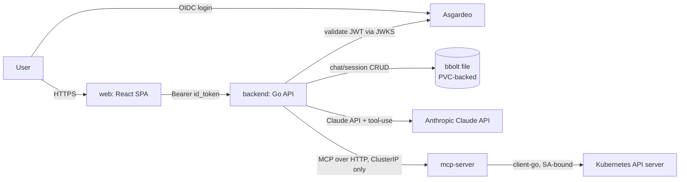

# Klyde Agent — Plan

Chat UI, Asgardeo-protected, backend calls Claude via MCP, MCP server holds privileged cluster read access (GET/DESCRIBE only).

## Goals

- Lightweight: fewest pods, no heavy DB, no local model.
- Privilege isolation: only the MCP pod touches the Kubernetes API. Web-facing backend has zero cluster RBAC.
- Read-only cluster access: verbs `get`, `list`, `watch` only. No `create`/`update`/`patch`/`delete`. `describe` = client-side composition of `get` + related `list` calls (events, endpoints), same as `kubectl describe`.

## Architecture



## Components

### 1. `web/` — React SPA
- Vite + React, minimal deps (no heavy UI framework/state library — plain fetch, small router if needed). Built to static assets, served by nginx (same pattern as `site/`: tiny image, no Node runtime in prod).
- Asgardeo OIDC Authorization Code + PKCE flow, browser-side (no client secret in SPA) via `@asgardeo/auth-react` or raw `oidc-client-ts` — pick the smaller dependency at build time.
- On login, holds `id_token`/`access_token`; sends as `Authorization: Bearer` to backend.
- No cluster or LLM logic here — dumb chat UI.

### 2. `backend/` — API (Go, mirrors `api/` conventions)
- Validates Asgardeo tokens: fetch JWKS from Asgardeo issuer, verify signature/`aud`/`iss`/`exp` per request. No session cookies needed if validating bearer token each call.
- Endpoints: `POST /api/chat` (send message, gets Claude response), `GET /api/sessions`, `GET /api/sessions/{id}`.
- Owns the Claude tool-use loop: sends user message + tool schema to Claude API; when Claude requests a tool call, backend forwards it to `mcp-server` over internal HTTP (ClusterIP), returns tool result to Claude, repeats until final answer.
- **No Kubernetes RBAC of its own** — cannot reach the K8s API directly, only via `mcp-server`.
- Storage: embedded `bbolt` (pure-Go, no separate DB process) file on a small PVC. Buckets: `sessions`, `messages`. Single replica (bbolt is single-writer) — acceptable per "lightweight" priority; documented limitation below.

### 3. `mcp-server/` — the privileged pod
- Implements MCP (Model Context Protocol) over HTTP/SSE, exposing tools to the backend's Claude tool-use loop:
  - `k8s_get(kind, namespace?, name?)` → wraps client-go `List`/`Get`.
  - `k8s_describe(kind, namespace, name)` → `Get` + related events/endpoints, formatted like `kubectl describe`.
- Runs with a dedicated `ServiceAccount` bound to read-only `ClusterRole`.
- No ingress, no external route — `ClusterIP` Service reachable only from `backend` (enforced by `NetworkPolicy`).
- Stateless, no DB.

## RBAC (cluster-wide, read-only)

```yaml
apiVersion: rbac.authorization.k8s.io/v1
kind: ClusterRole
metadata:
  name: agent-mcp-reader
rules:
  - apiGroups: ["", "apps", "batch", "networking.k8s.io", "autoscaling"]
    resources: ["pods", "deployments", "replicasets", "statefulsets", "daemonsets",
                "services", "endpoints", "configmaps", "namespaces", "nodes",
                "events", "jobs", "cronjobs", "ingresses", "persistentvolumeclaims"]
    verbs: ["get", "list", "watch"]
```
- **`secrets` intentionally excluded** — an LLM-driven agent reading Secret values is a real exfiltration risk (prompt injection via a compromised workload label/annotation could ask the agent to dump a secret into chat). Flagging this as a decision, not silently deciding: if you need secret *names* (not values) for context, `list`/`get` on `secrets` still returns `data` unless the tool code redacts it — so if secrets access is ever added, redact `.data`/`.stringData` in `mcp-server` before it reaches Claude.
- `NetworkPolicy` on `mcp-server`: ingress allowed only from pods labeled `app: backend`, in the `twotakeone` namespace.

## Namespace & manifests (all resources in `twotakeone` namespace, kustomize-managed like the rest of the repo)

```
agent/
  PLAN.md
  manifests/
    namespace.yaml
    serviceaccount-mcp.yaml
    clusterrole-mcp-reader.yaml
    clusterrolebinding-mcp-reader.yaml
    mcp-deployment.yaml
    mcp-service.yaml
    networkpolicy-mcp.yaml
    backend-deployment.yaml       # PVC for bbolt file, no SA cluster perms
    backend-pvc.yaml
    backend-service.yaml
    web-deployment.yaml
    web-service.yaml
    ingress.yaml                  # web + backend routes, TLS
    secret-asgardeo.example.yaml  # client ID, issuer URL (no secret needed for SPA PKCE flow)
    secret-anthropic.example.yaml # ANTHROPIC_API_KEY
  kustomization.yaml
web/       # SPA source
backend/   # Go API source
mcp-server/ # Go MCP tool server source
```
Follows existing repo pattern (`manifests/`, `*.example.yaml` for secrets, per-namespace kustomization, resource `requests`/`limits` on every container, Kyverno policies already enforced cluster-wide will require probes/labels/limits — build these in from the start rather than retrofitting).

## Asgardeo setup (manual, one-time)

1. Register a **Single-Page Application** in Asgardeo: redirect URI = `https://agent.<domain>/callback`, grant type = Authorization Code + PKCE, no client secret.
2. Register the backend as a **protected API resource** (or just validate the SPA's access token — Asgardeo issues JWTs with the SPA app as audience by default; backend checks `iss` = Asgardeo org URL, `aud` = SPA client ID).
3. Store issuer URL + client ID in a ConfigMap (not secret — these are public for PKCE flow). Only the `ANTHROPIC_API_KEY` is an actual secret.

## Build order (milestones)

1. `manifests/namespace.yaml` + RBAC + `mcp-server` skeleton (tools return static/fake data) — prove the privilege boundary and NetworkPolicy work.
2. `mcp-server` real client-go tool implementations (`k8s_get`, `k8s_describe`).
3. `backend` bbolt storage + session endpoints (no LLM yet) — CRUD chat sessions.
4. `backend` Claude API integration + MCP tool-use loop (call `mcp-server`, feed results back to Claude).
5. `web` SPA with Asgardeo PKCE login, chat interface.
6. Wire `backend` JWT validation against Asgardeo JWKS, ingress + TLS.
7. Kyverno compliance pass (labels, probes, resource limits — required cluster-wide per existing policies), then deploy.

## Known limitations (accepted for "lightweight")

- bbolt = single replica for `backend`. If this ever needs horizontal scaling, swap to Redis (already scoped as the fallback option) — schema-compatible key design (`session:<id>`, `msg:<session>:<seq>`) chosen up front so migration is a storage-layer swap, not a rewrite.
- Cluster-wide read access means any prompt-injection bug in the LLM path can be used to enumerate the whole cluster's non-secret resources. Mitigate by: no `secrets`, `mcp-server` isolated behind `NetworkPolicy`, and (future) an allowlist of namespaces if this turns out to be too broad in practice.
