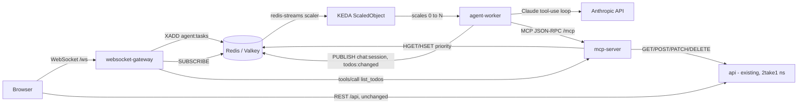

# TaskDone — AI-agentic Todo Prioritizer

A small, real KEDA use case bolted onto the existing `api`/`db` todo app:
a chat box where you describe your tasks and an LLM agent reorders your
todo list by priority via [MCP](https://modelcontextprotocol.io/) tool
calls, live over a WebSocket, with its own worker pod scaled from **zero**
by KEDA off a Redis Stream's backlog — not CPU/memory.

**Nothing in `api/`, `db`, or `site/` is touched.** Priority isn't a new
MariaDB column; it's stored in Redis and merged with `api`'s data at read
time by `mcp-server`. Every resource here lives in its own `todo-agent`
namespace and can be deployed or torn down independently of the rest of
the repo.

## Architecture



| Service | Language | Role | Scaling |
|---|---|---|---|
| `web/` | static HTML/JS, nginx | Todo list UI (talks to existing `api` directly) + chat box (talks to `websocket-gateway`) | fixed, 1 replica |
| `websocket-gateway/` | Go | WS server: pushes live todo-list + chat replies; publishes chat input to the Redis Stream; subscribes to Redis Pub/Sub for updates | fixed, 1 replica |
| `mcp-server/` | Go | MCP-over-HTTP tool server: `list_todos`, `add_todo`, `set_priority`, `complete_todo`, `delete_todo`. Calls `api` over HTTP for text/done/id, Redis for priority | fixed, 1 replica |
| `agent-worker/` | Python | Claude tool-use loop. Consumes the `agent:tasks` Redis Stream via a consumer group, calls `mcp-server`'s tools, publishes the reply + a change notification | **KEDA-scaled, `minReplicaCount: 0`** |
| Redis (Valkey) | infra | queue (Streams) + pub/sub + priority KV, no PVC | fixed, 1 replica |

Valkey (`valkey/valkey:8-alpine`) rather than Redis proper: same wire
protocol (KEDA's `redis-streams` scaler and the Go/Python clients here work
against it unmodified), BSD-licensed, the actively-developed fork since
Redis's 2024 license change.

### Why this is a real KEDA use case

`agent-worker` calls a paid LLM API per invocation and has no reason to sit
warm. The `ScaledObject` (`manifests/scaledobject-agent-worker.yaml`) uses
the `redis-streams` scaler's `lagCount` metric — stream length minus the
consumer group's last-delivered offset — which reflects backlog even with
**zero** consumers running, so it can trigger the very first scale-up from
0. `pendingEntriesCount` (KEDA's other option for this scaler) would stay
at 0 forever with nothing reading, and a plain HPA can't scale from zero or
trigger on a queue depth at all — this repo's other autoscaler,
`../rollouts/manifests/hpa.yaml`, only reacts to CPU/memory on an
always-running Deployment.

## Data flow

- **Priority storage**: Redis hash `todo:priority` (field = todo ID,
  value = 0-100). `mcp-server`'s `list_todos` calls `GET /api/todos`,
  merges in each row's priority (0 if unset), returns sorted by priority
  desc then id asc. `websocket-gateway` calls the same tool for every
  snapshot it sends, so there's one source of merged truth.
- **Chat path**: browser → WS `{"type":"chat","text":...}` →
  `websocket-gateway` assigns a UUID session id → `XADD agent:tasks` →
  KEDA scales `agent-worker` 0→1 → the Claude tool-use loop runs against
  `mcp-server` → `PUBLISH chat:<session_id>` (the reply) and
  `PUBLISH todos:changed` → `websocket-gateway` routes the reply to that
  one browser tab and re-broadcasts the todo list to every connected tab.
- **Manual edits**: the web UI's checkbox/add/delete controls call
  `api` directly (unchanged REST), then send `{"type":"refresh"}` over the
  same socket so the priority-merged view stays in sync without a second
  code path.

## Prerequisites (one-time, cluster-wide)

```bash
helm repo add kedacore https://kedacore.github.io/charts
helm repo update
helm install keda kedacore/keda --namespace keda --create-namespace
```

No Prometheus needed — the KEDA trigger here is `redis-streams`, not a
custom metric.

## Deploy

```bash
cp keda/manifests/secret-anthropic.example.yaml keda/manifests/secret-anthropic.yaml
# edit secret-anthropic.yaml: put a real ANTHROPIC_API_KEY in api-key
# add "manifests/secret-anthropic.yaml" to keda/kustomization.yaml's resources

kubectl apply -k keda/
```

Everything comes up except `agent-worker`, which should sit at **0**
replicas until a chat message is queued — that's the scale-to-zero proof
point, not a bug.

## Demo

`manifests/ingress.yaml` puts this on its own host, `taskdone.2take1.nl` --
distinct from the `2take1.nl` root path that `rollouts/` already owns (see
`rollouts/README.md`), so there's no collision and it's applied by default.
Point that DNS name at the cluster's ingress and cert-manager issues its
own TLS cert (`taskdone-tls`) the same way `2take1-tls` works for the root
site.

No public DNS yet, or just iterating locally? Port-forward instead:

```bash
kubectl port-forward -n todo-agent svc/web 8081:80
```

Open `http://localhost:8081` (or `https://taskdone.2take1.nl` once DNS is
wired up), add a couple of todos, then type something like *"I need to
submit the report by Friday, buy groceries, and call the dentist — sort
these by urgency"* into the chat box.

Watch the scale-to-zero happen:

```bash
kubectl get pods -n todo-agent -w
```

`agent-worker` should appear, process the message, and scale back to 0
after `cooldownPeriod` (60s) once the stream is empty.

## Known limitations (accepted for a demo project)

- Redis has no PVC — the priority hash and any in-flight chat state are
  lost on a pod restart. Not a real durability requirement here.
- `agent-worker` has a fixed 8-tool-call ceiling per chat turn
  (`MAX_TOOL_ITERATIONS` in `agent-worker/main.py`) to bound cost on a
  runaway loop; it reports back to the user if it hits that limit instead
  of finishing silently.
- `websocket-gateway` and `web` are always-on, fixed-replica — only
  `agent-worker` is KEDA-scaled. The gateway has to hold live connections,
  so scale-to-zero doesn't apply to it the same way.
- Model is pinned to `claude-opus-5` (`MODEL` env var on
  `agent-worker-deployment.yaml`) — swap to a cheaper model there if
  running this demo often is a cost concern.
